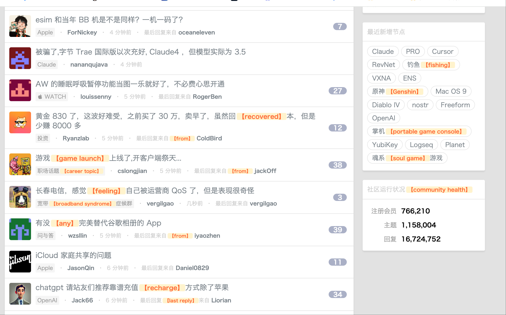
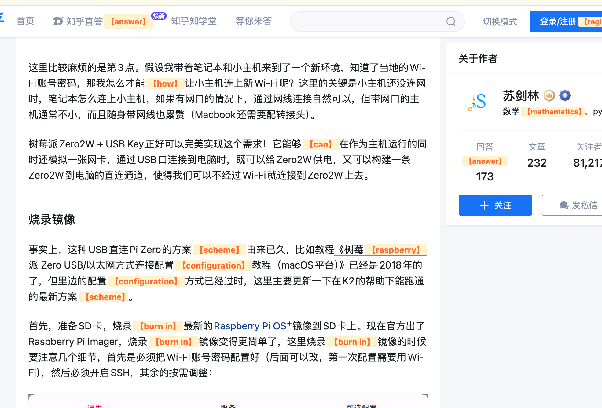

# TransLens - 沉浸式中文学习助手

[](LICENSE)
[](https://python.org)
[](https://developer.chrome.com/docs/extensions/)

> 一个智能的沉浸式中文学习工具，通过AI翻译和Chrome插件，帮助用户在浏览网页时自然学习中文词汇的英文表达。

## ✨ 特色功能

- 🤖 **智能词汇选择**: 基于词频算法，优先选择学习频率较低的词汇
- 🎯 **精准上下文翻译**: 使用微调的Qwen3-4B模型，根据语境准确翻译
- 🔧 **本地化部署**: 完全本地运行，保护隐私数据
- 💾 **智能缓存系统**: 避免重复翻译，提升响应速度
- 🌐 **无缝浏览体验**: Chrome插件自动识别中文内容并添加英文标注
- 📊 **学习追踪**: 记录词汇学习频率，个性化学习路径

## 🛠️ 技术架构

- **AI模型**: 微调的 Qwen/Qwen3-4B-Instruct-2507
- **后端服务**: Flask + Python
- **模型推理**: llama.cpp (GGUF格式)
- **前端扩展**: Chrome Extension (Manifest V3)
- **缓存系统**: JSON文件存储

## 📦 安装指南

### 1. 下载模型权重

```bash
# 下载预训练的GGUF模型文件 (约2.5GB)
wget https://huggingface.co/golangboy/TransLens/resolve/main/translate_model_gguf_q5km.gguf
```

### 2. 部署AI模型服务

```bash
# 使用llama-server部署模型 (需要先安装llama.cpp)
./llama-server -m translate_model_gguf_q5km.gguf --port 8080
```

### 3. 启动后端API服务

```bash
# 安装Python依赖
pip install flask flask-cors requests jieba

# 启动Flask后端服务
python gguf_model.py
```
服务将在 `http://localhost:5000` 启动

### 4. 安装Chrome插件

1. 打开Chrome浏览器，访问 `chrome://extensions/`
2. 开启右上角的 **"开发者模式"**
3. 点击 **"加载已解压的扩展程序"**
4. 选择项目中的 `translate/` 文件夹
5. 插件安装完成！

## 🚀 使用方法

1. **启动服务**: 确保AI模型和后端API都在运行
2. **浏览网页**: 访问任何包含中文内容的网页
3. **自动翻译**: 插件会自动识别中文文本，选择关键词汇并添加英文标注
4. **学习追踪**: 系统会记录你的学习历史，优化后续的词汇推荐

## 📁 项目结构

```
TransLens/
├── gguf_model.py           # Flask后端API服务
├── translate/              # Chrome插件文件夹
│   ├── manifest.json       # 插件配置文件
│   ├── content.js          # 核心功能脚本
│   └── README.md           # 插件说明文档
├── figures/                # 效果演示图片
│   ├── 1.png
│   ├── 2.png
│   └── 3.png
├── translation_cache.json  # 翻译缓存数据
├── word_frequency.json     # 词汇学习频率统计
└── README.MD               # 项目说明文档
```

## 🎯 核心特性详解

### 智能词汇选择算法
- 使用jieba分词提取名词和动词
- 基于反向权重算法，优先推荐学习频率低的词汇
- 避免重复学习已熟悉的词汇

### 缓存与优化
- 翻译结果本地缓存，避免重复API调用
- 词汇频率统计，个性化学习体验
- 支持批量翻译和延迟加载

### 浏览器兼容性
- 支持所有现代网站
- 动态内容识别(B站、抖音等平台可能存在限制)
- 不影响原网页功能

## 📊 效果展示


  


## ⚠️ 注意事项

- 某些动态加载内容的网站(如B站、抖音)可能无法完全捕获
- 首次使用需要下载较大的模型文件
- 建议在学习模式下使用，避免影响正常浏览体验

## 🤝 贡献指南

欢迎提交Issue和Pull Request来改进项目！

## 📄 许可证

本项目采用 MIT 许可证 - 详见 [LICENSE](LICENSE) 文件

---

💡 **如有问题或建议，欢迎提交Issue讨论！**
