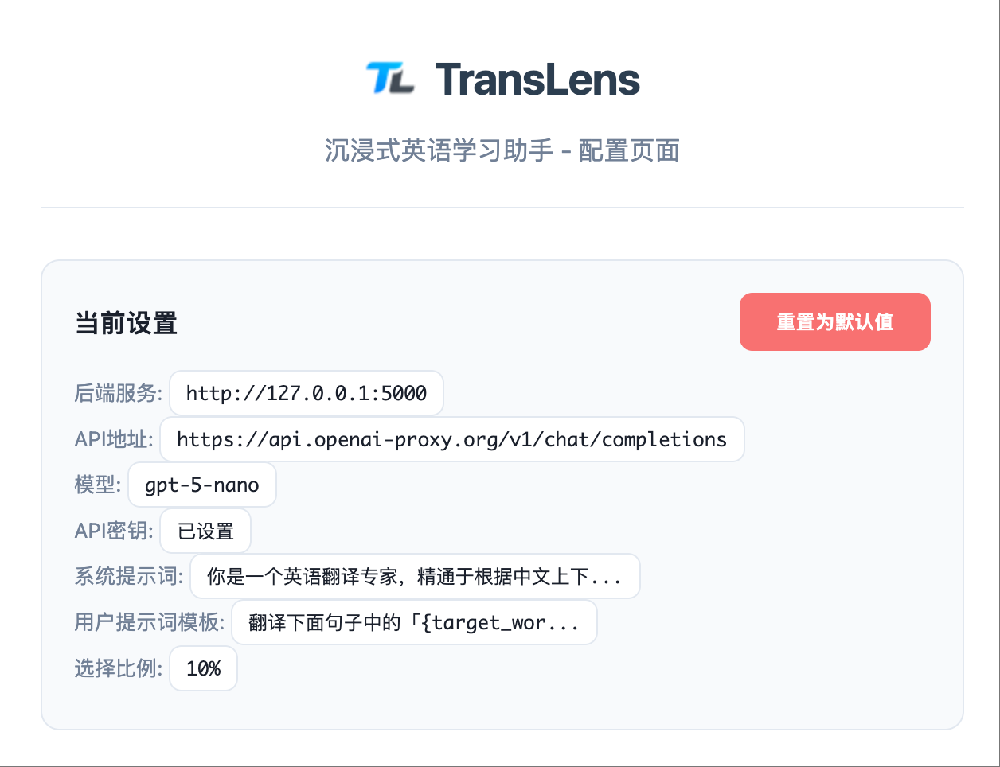

# TransLens - 沉浸式英语单词学习助手

<p align="center">
  
</p>

[](LICENSE)
[](https://python.org)
[](https://developer.chrome.com/docs/extensions/)
[](https://platform.openai.com/docs/api-reference)

> 一个沉浸式英语单词学习工具，支持本地AI模型和云端OpenAI兼容API，通过Chrome插件帮助用户在浏览网页时自然学习英语单词。

## ✨ 核心功能

- 🤖 **智能词汇选择**: 优先学习低频词汇
- 🔧 **灵活部署**: 支持本地AI模型或云端API
- 🌐 **网页翻译**: 浏览时自动添加中文翻译
- 📊 **学习追踪**: 记录学习历史，优化推荐
- ⚙️ **可视化配置**: 图形界面配置AI服务

## 🛠️ 技术架构

- **AI模型**: 支持任意模型或云端OpenAI兼容API
- **后端服务**: Flask + Python
- **前端扩展**: Chrome Extension (Manifest V3) + 可视化配置界面
- **缓存系统**: JSON文件存储
- **API支持**: OpenAI兼容接口，支持多种LLM服务商

## 📦 安装指南

### 方式一：本地部署 (推荐)

#### 1. 准备GGUF格式模型

```bash
# 推荐：下载项目微调的翻译专用模型 (约8.05GB，翻译效果更佳)
wget https://huggingface.co/golangboy/TransLens/resolve/main/translate_model_gguf_q5km.gguf

# 或者使用其他任意GGUF格式模型，如：
# - Qwen系列: qwen2-7b-instruct-q4_0.gguf
# - Llama系列: llama-2-7b-chat-q4_0.gguf  
# - 其他开源模型的GGUF版本
```

#### 2. 部署AI模型服务

```bash
# 使用llama-server部署模型 (需要先安装llama.cpp)
# 使用推荐的微调模型：
./llama-server -m translate_model_gguf_q5km.gguf --port 8080

# 或使用其他GGUF模型：
# ./llama-server -m your_model.gguf --port 8080
```

#### 3. 启动后端API服务

```bash
# 安装Python依赖
pip install flask flask-cors requests jieba

# 启动Flask后端服务
python main.py
```
服务将在 `http://localhost:5000` 启动

### 方式二：云端API模式

如果您不想下载模型文件，可以使用云端API（⚠️ 注意：可能导致速度较慢且产生费用）：

1. 跳过步骤1和2
2. 启动后端服务（步骤3）
3. 在Chrome插件配置界面设置您的API服务商信息

### 4. 安装Chrome插件

1. 打开Chrome浏览器，访问 `chrome://extensions/`
2. 开启右上角的 **"开发者模式"**
3. 点击 **"加载已解压的扩展程序"**
4. 选择项目中的 `chrome_ext/` 文件夹
5. 插件安装完成！

### 5. 配置LLM服务

安装完成后，点击插件图标进入配置界面：

#### 本地模式配置：
- **后端服务地址**: `http://localhost:5000`
- **API地址**: `http://localhost:8080/v1/chat/completions`
- 其他选项保持默认即可

#### 云端API模式配置：
- **后端服务地址**: `http://localhost:5000`
- **API地址**: 您的LLM服务商API地址（如 `https://api.openai.com/v1/chat/completions`）
- **API密钥**: 您的API Key
- **模型名称**: 如 `gpt-3.5-turbo`、`gpt-4` 等
- **自定义提示词**: 可根据需求调整系统提示词和用户提示词模板

⚠️ **云端API使用提醒**：
- 响应速度可能较慢，取决于网络连接和服务商负载
- 会产生API调用费用，请注意成本控制
- 数据会发送到第三方服务商，隐私性不如本地部署

## 🚀 使用方法

1. **配置服务**: 在Chrome插件配置界面设置LLM服务（本地或云端）
2. **测试连接**: 使用"测试学习助手"功能验证配置是否正确
3. **浏览网页**: 访问任何包含英文内容的网页
4. **自动翻译**: 插件会自动识别英文文本，选择关键词汇并添加中文翻译
5. **学习追踪**: 系统会记录你的学习历史，优化后续的词汇推荐
6. **个性化配置**: 可在设置界面调整选择比例、自定义提示词等参数

## 📁 项目结构

```
TransLens/
├── main.py                 # Flask后端API服务
├── chrome_ext/             # Chrome插件文件夹
│   ├── manifest.json       # 插件配置文件
│   ├── content.js          # 核心功能脚本
│   ├── popup.js            # 弹窗配置脚本
│   ├── settings.html       # 配置界面
│   ├── config.js           # 共享配置文件
│   └── background.js       # 后台服务脚本
├── data/                   # 数据存储目录
│   ├── translation_cache.json  # 翻译缓存数据
│   ├── word_frequency.json     # 词汇学习频率统计
│   └── familiar_words.json     # 熟悉单词列表
├── figures/                # 效果演示图片
│   ├── 1.png
│   ├── 2.png
│   ├── 3.png
│   └── 4.png
└── README.MD               # 项目说明文档
```

## 📊 效果展示




## 🤝 贡献指南

欢迎提交Issue和Pull Request来改进项目！

## 📄 许可证

本项目采用 MIT 许可证 - 详见 [LICENSE](LICENSE) 文件

---

💡 **如有问题或建议，欢迎提交Issue讨论！**
